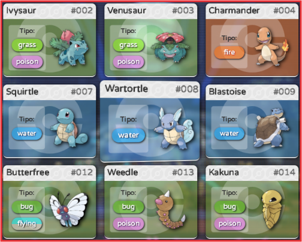

<p align="center">

</p>

**_Desenvolvido por:_** _Thiago de Oliveira Miranda_.&nbsp;&nbsp;&nbsp;|&nbsp;&nbsp;&nbsp;[Github](https://github.com/ThiagoOMiranda)&nbsp;&nbsp;&nbsp;|&nbsp;&nbsp;&nbsp;[LinkedIn](https://www.linkedin.com/in/thiago-de-oliveira-miranda-5393181a7/)

---

<p align="center"></p>

<h2 align="center">

**POKÉDEX JS ( _Versão Javascript_ )**

</h2>

<spam align="center">

https://thiagoomiranda.github.io/js-developer-pokedex/

</spam>

---

<br>

### **`Sumário:`**

<p align="center">
    <a href="#escopo">Escopo do Projeto</a>&nbsp;&nbsp;&nbsp;|&nbsp;&nbsp;&nbsp;
    <a href="#conceitos">Conceitos Explorados</a>&nbsp;&nbsp;&nbsp;|&nbsp;&nbsp;&nbsp;
    <a href="#exercicio">Exercício Apresentado</a>&nbsp;&nbsp;&nbsp;|&nbsp;&nbsp;&nbsp;
    <a href="#resultado">Resultado Obtido</a>&nbsp;&nbsp;&nbsp;|&nbsp;&nbsp;&nbsp;
    <a href="#design">Detalhes Visuais</a>&nbsp;&nbsp;&nbsp;|&nbsp;&nbsp;&nbsp;
    <a href="#melhorias">Melhorias Implementadas</a>
</p>

<br>

<br>

## **`Escopo do Projeto:`** <a name="escopo"></a>

&emsp;&emsp;O exercício proposto consistia em recriar a **_pokédex_**, com o intúito de aplicar conceitos básicos de programação em Javascript. Os principais conceitos aplicados no desenvolvimento deste projeto foram:

<br>

## **`Conceitos Explorados:`** <a name="conceitos"></a>

**API:** _(Application Programming Interface)_ ou Interface de Programação de Aplicativos, é um conjunto de regras e protocolos que permite que diferentes softwares se comuniquem e interajam uns com os outros. Ela define as maneiras pelas quais os programas podem solicitar e compartilhar dados e funcionalidades específicas. Para este projeto foi utilizada a **pokeAPI**.

**Fetch:** Conceito relacionado ao ato de realizar uma solicitação _(request)_ para obtenção informações ou dados de uma fonte externa, _API, banco de dados ou servidor web_. Neste projeto foi implementado a partir da função **_'fetch'_** do Javascript.

```
pokeApi.getPokemonInfo = async (pokemonID) => {
  const url = `https://pokeapi.co/api/v2/pokemon/${pokemonID}`;

  try {
    const infoResponse = await fetch(url); //Requisita dados da url.

    if (!infoResponse.ok) {
      throw new Error(`An error occurred: ${infoResponse.status}`);
    } //Verifica se a resposta retorna erro

    pokemonInfoData = await infoResponse.json(); // Aguarda a realização do request e converte para .json.
    return convertPokeApiInfoToPokemon(pokemonInfoData);
  } catch (error) {
    console.error("An error occurred within getPokemonInfo: ", error);
    throw error;
  }
};
```

<p align="center"><i>Estrutura simples de uma função de requisição utilizando fetch data.</i></p>

<br>

**Promises:** Promises (promessas) são objetos JavaScript que representam o resultado eventual (concluído ou falha) de uma operação assíncrona. Elas são usadas para lidar com código assíncrono de maneira mais estruturada, permitindo que você encadeie operações e trate erros de forma mais eficiente.

<br>

**Async/Await:** É uma maneira de escrever código _assíncrono_ de forma _síncrona e mais legível_. A palavra-chave **_async_** é usada para definir funções assíncronas, enquanto **_await_** é usado dentro dessas funções para esperar que Promises sejam resolvidas, permitindo que o código continue de forma síncrona. Isso simplifica o tratamento de código assíncrono e torna o fluxo de controle mais claro.

```
const responseData = await response.json(); // Request inicial dos dados gerais de uma lista de pokemons
    const pokemons = responseData.results;
    const detailRequests = pokemons.map(pokeApi.getPokemonInfo); // request individual de detalhes de cada pokemon.
    const pokemonsDetails = await Promise.all(detailRequests); // a "espera" para a conclusão de todos os requests anteriores.

    return pokemonsDetails;
```

<p align="center"><i>Aplicação básica de promisses no escopo de uma função request.</i></p>

<br>

**URL Params:** Ou _parâmetros de URL_, são informações passadas em uma URL após o ponto de interrogação "?" e são usados para transmitir dados específicos para uma página da web ou aplicativo. Eles são geralmente usados em requisições _HTTP GET_ para fornecer informações para o servidor ou para controlar o comportamento de uma página da web.

```
const redirectToDetailPage = () => {
  const pokemons = document.querySelectorAll("[data-id]");
  pokemons.forEach((pokemon) => {
    pokemon.addEventListener("click", (event) => {
      const pokemonId = event.currentTarget.id;

      if (pokemonId !== "") {
        window.location.href = `pokemon.html?id=${pokemonId}`;
      }
    });
  });
};
```

<p align="center"><i>Função de redirecionamento que inclui os parâmetros url.</i></p>

<br>

```
document.addEventListener("DOMContentLoaded", function () {
  const urlParams = new URLSearchParams(window.location.search);
  const pokemonId = urlParams.get("id");

  requestPokemonDetails(pokemonId);
  requestPokemonEvol(pokemonId);
});
```

<p align="center"><i>Função que coleta os dados incluídos e os redistribui no código.</i></p>

<br>

**Intersection Observer API**: Esta é uma API nativa do JavaScript que permite observar mudanças na interseção entre um _elemento HTML_ (como uma imagem) e o viewport do navegador. É usado principalmente para implementar carregamento preguiçoso _(lazy loading)_ de imagens, onde as imagens são carregadas sob demanda conforme o usuário rola a página, também conhecido como _infinite scroll_.

<br>

**DOMParser( ).parseFromString( )**: é um método da classe **_DOMParser_** em JavaScript que permite analisar uma string contendo código HTML ou XML e criar um novo documento DOM a partir dessa string. Esse método é especialmente útil quando você deseja manipular ou interagir com dados HTML ou XML como se fossem parte do documento atual.

```
const pokemonHtmlString = `
  <li class="pokemon ${pokemon.type}" id="${pokemon.number}">
        <div class="basic-info">
            <span class="name">${pokemon.name}</span>
            <span class="number">#${pokemon.number}</span>
        </div>
        <div class="detail">
          <ol class="types">
                <span>Tipo:</span>
                ${pokemon.types.map((type) => `<li class="type ${type}">${type}</li>`).join("")}
          </ol>
          
        </div>
    </li>`; // String contendo a descrição exata do elemento a ser criado.

const fragment = document.createDocumentFragment(); // Fragmento para conter o novo NodeElement sem afetar a página.
const parser = new DOMParser(); // Implementação da classe DOMParser.
const pokemonElement = parser.parseFromString(pokemonHtmlString, "text/html").body.firstChild; // Descrição do método utilizado para analisar a string.
handleVanillaTilt(pokemonElement); // Permite referenciar o elemento criado diretamente sem utilizar os seletores.
fragment.appendChild(pokemonElement); // Inserção de elementos no fragmento DOM.
pokemonListElement.appendChild(fragment); // Inserção do fragmento na página.
```

<p align="center"><i>Escopo da utilização da classe DOMParse e o método parseFromString().</i></p>

<br>

<br>

**Model Classes:** Ou _classes de modelo_, elas mapeiam os dados recebidos da API para objetos em JavaScript, tornando mais fácil acessar e manipular esses dados em todo o projeto. Isso promove um código mais limpo, legível e manutenível, além de permitir que os desenvolvedores tenham uma representação clara dos dados, facilitando a interação com a API e evitando erros comuns de manipulação de dados.

```
class PokemonDetail {
  number;
  name;
  type;
  types = [];
  image;
  ability;
  abilities = [];
  height;
  weight;
  stats = {};
}
```

<p align="center"><i>Classe utilizada no projeto para organizar os dados coletados na API.</i></p>

<br>

---

<br>

### **`Exercício Apresentado:`** <a name="exercicio"></a>

<br>

<p align="center"></p>

<p align="center"><i>Figura 01: Tela da atividade.</i></p>

<br>

---

&emsp;&emsp;Parte importante e adicional da atividade foi customizar o código, adicionar melhorias e características próprias com ênfase no aprendizado e na aplicação de novos métodos e funções do Javascript,CSS e HTML.

---

<br>

### **`Resultado Obtido:`** <a name="resultado"></a>

<br>

<p align="center"></p>

<p align="center"><i>Figura 02: Tela final do projeto.</i></p>

<br>

---

<br>

### **`Detalhes Visuais:`** <a name="design"></a>

<br>

<p align="center"></p>

<p align="center"><i>Figura 03: Design dos cards e efeito VanillaTilt na versão Desktop.</i></p>

<br>

---

<br>

### **`Página de Detalhes:`** <a name="detalhes"></a>

<br>

<p align="center"></p>

<p align="center"><i>Figuras 04: Telas de detalhes.</i></p>

<p align="center"><i>
LEGENDA:
1. Botão de voltar.
2. Figura do Pokemon.
3. Botão de girar o card.
4. Informações básicas.
5. Dados detalhados.
6. Card do Pokemon base.
7. Cards das evoluções.
</i></p>

<br>

---

<br>

### **`Melhorias Implementadas:`** <a name="melhorias"></a>

<br>

- [x] "_Mobile First_" e _responsividade_ para dispositivos móveis e desktops.
- [x] Backgrounds rotativos transicionados em loop.
- [x] Logomarca em SVG animada com _@keyframes_ no CSS.
- [x] Redirecionamento para a página de detalhes com Url Params.
- [x] Condição que define as regras de offset, limite e placeholders em função do screensize e orientação da tela.
- [x] Implementação do plugin VanillaTilt para interação pseudo3D em desktops.
- [x] Implementação do carregamento de novos itens no método de scroll infinito _(lazy loading)_.
- [x] Página de detalhes do pokemon selecionado preenchida dinamicamente.
- [x] Background dinâmico para cada card pokemon em função do tipo.
- [x] Background animado na página de detalhes com animação aplicada na figura do pokemon.
- [x] Barras de stats com carregamento animado em função dos valores.
- [x] Página de evoluções dos pokemons com links direcionados.
- [x] Funcionalidade que identifica se a tela está na orientação retrato, ou se o dispositivo é mobile, desktop ou tablet.
- [x] Condição que adiciona botão de acesso à página de evoluções caso haja.

<br>

---

<br>

**CRÉDITOS**

<br>

&emsp;&emsp;Este jogo possui caráter didático e educacional, sem fins comerciais. Todos os direitos sobre a franquia, marca, personagens, gráficos correlatos à Pokemon pertencem à:

©2023 Pokémon. ©1995 - 2022 Nintendo/Creatures Inc./GAME FREAK inc. TM, ®Nintendo.

<br>

---

<p align="center">

</p>
